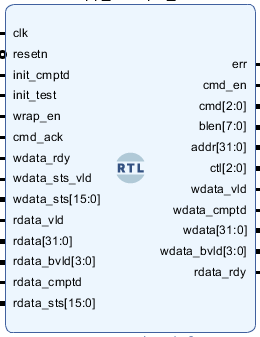

# DDR3 memory user interface documentation
   
## Module Port Documentation
### Clock and reset 
| **Port**         | **Direction** | **Width** | **Description**                                          |
|------------------|---------------|-----------|----------------------------------------------------------|
| `clk`            | Input         | 1         | Input clock signal                                       |
|`resetn`          | Input         | 1         | Active low reset signal                                  |

### Indicators 
| **Port**         | **Direction** | **Width** | **Description**                                          |
|------------------|---------------|-----------|----------------------------------------------------------|
| `init_cmptd`     | Input         | 1         | Indicate that DDR3 calibration is done and the memory is ready for use       | 
|`init_test`      | Input         | 1        | Initialize the test signal                                | 
|`wrap_en`        | Input         | 1         | Enable wrap transactions signal                           | 

### User command interface signals 
| **Port**         | **Direction** | **Width** | **Description**                                          |
|------------------|---------------|-----------|----------------------------------------------------------|
| `cmd_ack`        | Input         | 1         | Command has been accepted signal                          |                                      
|`cmd_en`         | Output        | 1        | Command enable signal                                     |                      
|`cmd`            | Output        | 3         | Command to be executed                                           | 
|`blen`           | Output        | 8         | Length of the burst Transaction                               | 
|`addr`           | Output        | 32        | The start address to be written or read                       | 
|`ctl`            | Output        | 3 | Control signal held at 2 for normal operation                                        | 

### Write Interface signals 
| **Port**         | **Direction** | **Width** | **Description**                                          |
|------------------|---------------|-----------|----------------------------------------------------------|
| `wdata_rdy`      | Input         | 1         | Indicates that the memory is ready to accept data to be written              |
|`wdata_vld`      | Output        | 1        | Write data valid signal                                   | 
|`wdata_cmptd`    | Output        | 1         | Write data completed signal. For last data to indicate the end of read operation         | 
|`wdata`          | Output        | C_AXI_DATA_WIDTH | Write data signal                                  | 
|`wdata_bvld`     | Output        | C_AXI_DATA_WIDTH/8 | Byte valids signal for write data                    |
|`wdata_sts_vld`  | Input         | -         | Status valid signal for write data                         | 
|`wdata_sts`      | Input         | WR_STS_WIDTH | Write status signal                                     | 

### Read interface signas 
| **Port**         | **Direction** | **Width** | **Description**                                          |
|------------------|---------------|-----------|----------------------------------------------------------|
| `rdata_vld`      | Input         | 1        | Read data valid signal                                    | 
|`rdata`          | Input         | C_AXI_DATA_WIDTH | Read data signal                                  | 
|`rdata_bvld`     | Input         | C_AXI_DATA_WIDTH/8 | Byte valids signal for read data                     |
|`rdata_cmptd`    | Input         | 1        | Read data completed signal                                | 
|`rdata_sts`      | Input         | RD_STS_WIDTH | Read status signal                                       | 
|`rdata_rdy`      | Output        | 1         | Read data ready signal                                    |   

## Write operation
1. Put write command on command port
   - CMD = 4
   - CMD_EN = 1
   - blen = 1 ( in our case we are just writing one address ... can be changed)
   - Address = begining of address to write ( Addr : Addr+blen will be written)
2. Wait for `cmd_ack` signal to indicate that the command is accepted.
3. Now the controller is being prepared to accept a write command So wait for `wdata_rdy` to be asserted
4. After the controller is ready put the data and raise a valid signal.
   
   

NOTE:
- `wdata_valid` should stay high for blen+1 cycles
- `wdata_cmptd` should be two cycles and should overlap with wdata_valid
- `wdata_sts_valid` indicates the end of write operation.

